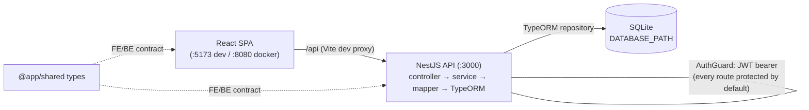

# SQS Recipe App

A full-stack TypeScript monorepo for managing recipes and their ingredients — built with React, NestJS, and SQLite to demonstrate software quality-assurance practices.

<div align="center">


[](https://sonarcloud.io/summary/new_code?id=thomasprade_thro-sqs-2026)
[](https://sonarcloud.io/summary/new_code?id=thomasprade_thro-sqs-2026)
[](https://sonarcloud.io/summary/new_code?id=thomasprade_thro-sqs-2026)
[](https://sonarcloud.io/summary/new_code?id=thomasprade_thro-sqs-2026)
[](https://sonarcloud.io/summary/new_code?id=thomasprade_thro-sqs-2026)
[](https://sonarcloud.io/summary/new_code?id=thomasprade_thro-sqs-2026)
[](https://sonarcloud.io/summary/new_code?id=thomasprade_thro-sqs-2026)
[](https://sonarcloud.io/summary/new_code?id=thomasprade_thro-sqs-2026)
[](https://sonarcloud.io/summary/new_code?id=thomasprade_thro-sqs-2026)
[](https://sonarcloud.io/summary/new_code?id=thomasprade_thro-sqs-2026)

[](https://sqs-recipe-app.readthedocs.io/en/latest/)

</div>

## Quickstart

This project can be run in two modes: Docker mode for local hosting with easy setup and development mode for local development.

### Prerequisites

- **Node.js 24**
- **Docker & Docker Compose** (for containerised setup)

### Docker Mode

```bash
# Build and start all containers
docker compose up --build
```

| Service    | URL                                            |
| ---------- | ---------------------------------------------- |
| Frontend   | [http://localhost:8080](http://localhost:8080) |
| Backend    | [http://localhost:3000](http://localhost:3000) |
| sqlite-web | [http://localhost:8081](http://localhost:8081) |

SQLite data is persisted to the host `./data/` directory via a Docker volume. To seed a user into the Docker-shared database:

```bash
npm run create-user:docker -- testuser testpass
```

> **Note:** the `docker-compose.yml` ships with a placeholder `JWT_SECRET=your-secure-jwt-secret`. Override it before any real deployment (see [Environment Variables](#environment-variables)).

### Development Mode

```bash
# 1. Install dependencies and build shared types
npm run setup

# 2. Seed a user — there is no signup endpoint, and every route is guarded
npm run create-user -w backend -- testuser testpass

# 3. Start frontend (localhost:5173) and backend (localhost:3000) together
npm run dev
```

The frontend dev server proxies `/api` requests to the backend automatically. Log in with the user you just created.

### Repository Usage / Commands

All scripts run from the repository root.

| Script                       | Description                                                 |
| ---------------------------- | ----------------------------------------------------------- |
| `npm run setup`              | Install all dependencies and build shared types             |
| `npm run dev`                | Start frontend and backend in watch mode (via concurrently) |
| `npm run build`              | Build shared → backend → frontend (production)              |
| `npm run test`               | Run backend + frontend unit tests                           |
| `npm run test:e2e`           | Run backend e2e + frontend Playwright UI tests              |
| `npm run test:integration`   | Run full-stack integration tests (Playwright in `e2e/`)     |
| `npm run test:all`           | Run all of the above tests sequentially                     |
| `npm run create-user:docker` | Create a backend user in the Docker-shared SQLite database  |
| `npm run lint`               | Lint all workspaces with ESLint                             |
| `npm run format:check`       | Check formatting with Prettier                              |
| `npm run format`             | Auto-fix formatting with Prettier                           |

The project is an **npm-workspaces monorepo** with four workspaces: `shared`, `backend`, `frontend`, and `e2e`.
Any workspace-specific command can be run from the root with the `-w` flag:

```bash
npm run test -w backend          # run only backend unit tests
npm run dev -w frontend          # start only the frontend dev server
npm run build -w shared          # rebuild shared types
npm run create-user -w backend -- <user> <pass>   # seed a dev user
```

## Overview

### Repository Structure

```text
├── shared/             Shared TypeScript types (API contract)
├── backend/            NestJS REST API with SQLite (TypeORM) + JWT auth
├── frontend/           React 19 SPA (Vite)
├── e2e/                Full-stack integration tests (Playwright)
├── docs/               Documentation (arc42, ADRs, hosted on Read the Docs)
├── data/               SQLite database files (gitignored, created on first run)
└── docker-compose.yml  For easy local setup with docker
```

Each code package has its own README with more detail:

- [shared/README.md](shared/README.md) — shared type definitions
- [backend/README.md](backend/README.md) — REST API server
- [frontend/README.md](frontend/README.md) — React frontend

### Architecture

Recipes and their Ingredients, exposed as a REST API behind JWT bearer auth.
A React app talks to a NestJS backend, which persists data to SQLite through TypeORM.
Shared TypeScript types in `@app/shared` are the single source of truth for the frontend/backend contract, so the wire format can never drift between the two.
Every route is protected by default; you authenticate with a seeded user and the frontend sends an `Authorization: Bearer` token.



- In dev mode (see below), the Vite dev server (`:5173`) proxies `/api` to the backend (`:3000`).
- Using the Docker setup, nginx serves the built frontend (`:8080`) and forwards `/api` to the backend.
- `AuthGuard` is registered globally, so every endpoint requires a valid JWT unless explicitly marked `@Public()`.

### Testing Strategy

This project implements a multi-layered testing approach:

```text
┌─────────────────────────────────────────────┐
│    Full-Stack Integration Tests (e2e/)      │  Playwright — real browser,
│    Frontend ↔ Backend ↔ Database            │  real servers, real DB
├─────────────────────────────────────────────┤
│    Frontend UI Tests (frontend/e2e/)        │  Playwright — browser tests
│    Backend E2E Tests (backend/test/)        │  Supertest — HTTP-level tests
├─────────────────────────────────────────────┤
│    Frontend Unit Tests (Vitest)             │  Component tests with
│    Backend Unit Tests (Jest)                │  React Testing Library / mocks
└─────────────────────────────────────────────┘
```

| Layer       | Tool                     | Location                     | What it tests                              |
| ----------- | ------------------------ | ---------------------------- | ------------------------------------------ |
| Unit (BE)   | Jest                     | `backend/src/**/*.spec.ts`   | Services and controllers with mocks        |
| Unit (FE)   | Vitest + Testing Library | `frontend/src/**/*.test.tsx` | React components in isolation              |
| E2E (BE)    | Jest + Supertest         | `backend/test/*.e2e-spec.ts` | Full HTTP request/response cycle           |
| UI (FE)     | Playwright               | `frontend/e2e/*.spec.ts`     | User interactions in a real browser        |
| Integration | Playwright               | `e2e/tests/*.spec.ts`        | Complete user flows through the full stack |

To run a single test, for example the in the backend, run: `npm run test -w backend -- recipe.service.spec.ts`.

## Environment Variables

| Variable        | What it does                                                | Default                  | Required                    |
| --------------- | ----------------------------------------------------------- | ------------------------ | --------------------------- |
| `PORT`          | Backend HTTP listen port                                    | `3000`                   | No                          |
| `DATABASE_PATH` | Path to the SQLite database file                            | `./data/database.sqlite` | No                          |
| `JWT_SECRET`    | Secret used to sign/verify JWTs (HS256, 24h)                | dev-only fallback value  | Yes: In any real deployment |
| `NODE_ENV`      | Environment mode; `production` makes `JWT_SECRET` mandatory | unset (development)      | No                          |

When `NODE_ENV=production`, the backend refuses to start without a real `JWT_SECRET`; in development it falls back to a hardcoded value. CORS is hardcoded to `http://localhost:5173` for dev.

## Contributing

- **Branch naming** — feature branches use `feature/#<issue>-<description>`; documentation branches use `docs/<topic>`.
- **Commit style** — [Conventional Commits](https://www.conventionalcommits.org/): `feat:`, `fix:`, `chore:`, `docs:`, etc., optionally with a PR reference, e.g. `feat: implement guards on buttons (#54)`.
- **Pull requests** — open PRs against `main`. CI (lint & format, backend tests, frontend tests, and the SonarCloud quality gate) must pass before merge.
- **Git hooks (husky)** — `pre-commit` runs `lint-staged` (ESLint `--fix` + Prettier on staged files); `pre-push` runs `knip` plus backend and frontend unit tests. Fix findings rather than bypassing the hooks.

The GitHub Actions workflow (`.github/workflows/ci.yml`) runs on every push to `main` and on pull requests: lint & format, backend tests, frontend tests, and a SonarCloud analysis that aggregates all coverage reports.

## License

This project is academic coursework for the Software Quality Assurance (SQS) module at TH Rosenheim and is not currently released under an open-source license. All rights reserved by the authors (Team "Exorbitant SQS").

## Thanks

Special Thanks to the Team behind Tanker24 for their help with the readthedocs pipeline.
