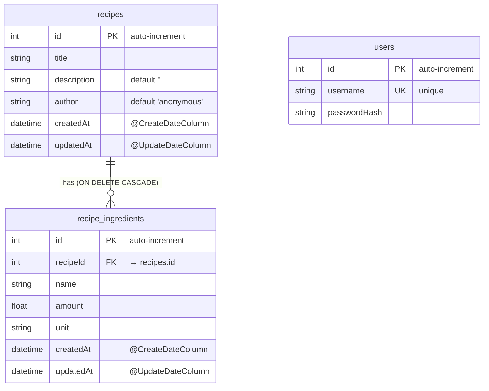

# Backend

NestJS REST API for Recipes and their Ingredients management, behind JWT bearer auth.
Persistence is TypeORM on SQLite (via `better-sqlite3`).

## Tech stack

| Concern    | Choice                                                                              |
| ---------- | ----------------------------------------------------------------------------------- |
| Runtime    | Node 24 (`mise.toml` / `.nvmrc`)                                                    |
| Language   | TypeScript                                                                          |
| Framework  | NestJS 11                                                                           |
| Database   | SQLite file via `better-sqlite3` + TypeORM 0.3 (`synchronize: true`, no migrations) |
| Validation | `class-validator` / `class-transformer` (global `ValidationPipe`)                   |
| Auth       | `@nestjs/jwt` (HS256) + `bcrypt`                                                    |

Schema is auto-derived from entities on boot (`synchronize: true`), so there are no migration files.
The API is purely request/response.

## Structure

```text
backend/
├── src/
│   ├── main.ts                       Application entrypoint (CORS, ValidationPipe, port)
│   ├── app.module.ts                 Root module (TypeORM + feature modules)
│   ├── architecture.spec.ts          Architecture rules test (archunit)
│   ├── auth/                         JWT auth: guard, service, users, constants
│   ├── recipes/                      Recipe feature
│   ├── ingredients/                  Ingredient feature
│   └── weather/                      Weather feature
├── scripts/
│   └── create-user.ts                Seed a login user (bcrypt-hashed)
├── test/
│   ├── *.e2e-spec.ts                 E2E tests (Supertest, in-memory SQLite)
│   ├── jest-e2e.json                 Jest config for e2e
│   └── justfile                      curl smoke tests against a live backend
└── Dockerfile
```

Each feature follows the same shape: `*.entity.ts` (TypeORM) → `*.service.ts` → `*.controller.ts`, with a `*.mapper.ts` (entity → shared type, strips internal fields / formats dates) and `*.dto.ts` (class-validator).
Mappers keep `Entity` shapes from leaking out of controllers — reuse them when adding endpoints.

## Local setup

Setup is done in the root directory.
See [Toplevel README.md](../README.md) for details.

The SQLite file is created on first boot at `DATABASE_PATH` (default `./data/database.sqlite`, relative to the backend root).
Deleting the sqlite file is the reset button, it is seeded with demo values.

### Seeding users

There is no signup endpoint, so users must be seeded before they can log in:

```bash
npm run create-user -w backend -- <username> <password>
```

This runs `scripts/create-user.ts`, which bcrypt-hashes the password and inserts a row into the `users` table of the database at `DATABASE_PATH`. For the Docker-shared database, use the root-level helper instead:

```bash
npm run create-user:docker   # from the repo root
```

## Environment variables

| Variable        | Purpose                           | Default                                                     | Format / notes                                              |
| --------------- | --------------------------------- | ----------------------------------------------------------- | ----------------------------------------------------------- |
| `DATABASE_PATH` | SQLite database file location     | `./data/database.sqlite`                                    | A filesystem path. Used by the API and `create-user`.       |
| `JWT_SECRET`    | HS256 signing/verification secret | dev fallback `dev-only-jwt-secret-do-not-use-in-production` | Required when `NODE_ENV=production` — boot throws if unset. |
| `NODE_ENV`      | Environment mode                  | _(unset)_                                                   | `production` makes `JWT_SECRET` mandatory.                  |
| `PORT`          | HTTP port the server listens on   | `3000`                                                      | number                                                      |

> The dev fallback secret exists only so local development works without configuration. Never run production without a real `JWT_SECRET`.

## API documentation

The endpoints are listed below. Routes carry their `/api` prefix in each `@Controller('api/...')` decorator (there is no global prefix). CORS is hardcoded to `http://localhost:5173` in `src/main.ts`.

### Auth — `/api/auth`

| Method | Path                | Access    | Body        | Response                          |
| ------ | ------------------- | --------- | ----------- | --------------------------------- |
| `POST` | `/api/auth/login`   | public    | `SignInDto` | `{ access_token: string }`        |
| `GET`  | `/api/auth/profile` | protected | —           | JWT payload (`{ sub, username }`) |

### Recipes — `/api/recipes`

| Method   | Path               | Access    | Body              | Response                |
| -------- | ------------------ | --------- | ----------------- | ----------------------- |
| `GET`    | `/api/recipes`     | public    | —                 | `ApiResponse<Recipe[]>` |
| `GET`    | `/api/recipes/:id` | public    | —                 | `ApiResponse<Recipe>`   |
| `POST`   | `/api/recipes`     | protected | `CreateRecipeDto` | `ApiResponse<Recipe>`   |
| `PUT`    | `/api/recipes/:id` | protected | `UpdateRecipeDto` | `ApiResponse<Recipe>`   |
| `DELETE` | `/api/recipes/:id` | protected | —                 | `{ message: string }`   |

### Ingredients — `/api/recipes/:recipeId/ingredients` (nested)

| Method   | Path                                               | Access    | Body                                 | Response                    |
| -------- | -------------------------------------------------- | --------- | ------------------------------------ | --------------------------- |
| `GET`    | `/api/recipes/:recipeId/ingredients`               | public    | —                                    | `ApiResponse<Ingredient[]>` |
| `POST`   | `/api/recipes/:recipeId/ingredients`               | protected | `CreateIngredientDto[]` _(an array)_ | `ApiResponse<Ingredient[]>` |
| `PUT`    | `/api/recipes/:recipeId/ingredients/:ingredientId` | protected | `UpdateIngredientDto`                | `ApiResponse<Ingredient>`   |
| `DELETE` | `/api/recipes/:recipeId/ingredients/:ingredientId` | protected | —                                    | `{ message: string }`       |

DTO field validation lives in each module's `*.dto.ts`; the wire-contract interfaces (`Recipe`, `Ingredient`, `CreateXDto`, `UpdateXDto`) live in `@app/shared` (`shared/src/types/`).

For ready-made curl examples against a live backend, see [`test/justfile`](test/justfile) (e.g. `just recipe-list`, `just recipe-create`).

## Database schema / ERD

`synchronize: true` derives these tables from the TypeORM entities on boot.



- `recipe_ingredients.recipe` is a `@ManyToOne` relation with `onDelete: 'CASCADE'` — deleting a recipe removes its ingredients.

## Auth model

Stateless JWT bearer auth.

- Algorithm / expiry: HS256, tokens valid r `24h` (`auth.module.ts`).
- Secret: resolved in `auth.constants.ts` from `JWT_SECRET` — required in production, dev fallback otherwise (see [Environment variables](#environment-variables)).
- Passwords: bcrypt-hashed (10 salt rounds); never stored in plaintext.
- Guard: `AuthGuard` is registered globally via `APP_GUARD` in `auth.module.ts`, so every route is protected by default. Opt out with the `@Public()` decorator — currently `POST /api/auth/login` and the recipe/ingredient `GET`s.
- Login flow: `POST /api/auth/login` with `{ username, password }` → `AuthService.signIn` verifies the bcrypt hash and signs a payload `{ sub: user.id, username }` → returns `{ access_token }`. Clients send it on protected routes as `Authorization: Bearer <token>`.
- No signup: seed users with the `create-user` script (see [Seeding users](#seeding-users)).

## Testing

| Kind         | Location                   | Runner            | Needs a live DB?                  |
| ------------ | -------------------------- | ----------------- | --------------------------------- |
| Unit         | `src/**/*.spec.ts`         | Jest              | No — repositories/services mocked |
| Architecture | `src/architecture.spec.ts` | Jest + `archunit` | No                                |
| E2E          | `test/*.e2e-spec.ts`       | Jest + Supertest  | No — boots the app on `:memory:`  |

```bash
npm run test -w backend          # unit + architecture tests
npm run test:e2e -w backend      # e2e tests (Supertest)
```

Run a single test:

```bash
npm run test -w backend -- recipe.service.spec.ts      # by file
npm run test -w backend -- -t "creates a recipe"       # by test name
npm run test:e2e -w backend -- recipe.e2e-spec.ts      # single e2e file
```

- Unit specs live next to source and wire modules via `Test.createTestingModule` with mocked TypeORM repositories / services.
- E2E specs in `test/` boot the full Nest app against an in-memory SQLite database(`:memory:`) and exercise real HTTP routes through Supertest — no external database required. Each suite seeds its own data (e.g. a bcrypt-hashed test user for the auth flow).
- Manual smoke tests:`test/justfile` holds curl recipes (`just recipe-list`, `just recipe-create`, `just ingredient-add recipe=2`, …) that assume a backend running on `localhost:3000`.

The cross-stack Playwright integration suite lives at the repo root in `e2e/` (`npm run test:integration`) and boots both real servers — see the root README; it is not part of this package.

## Docker

Dockerfile build a container for the local deployment of the backend.
The SQLite file lives at `/app/data/database.sqlite` in the container, mapped to `./data/` on the host via Docker Compose.
