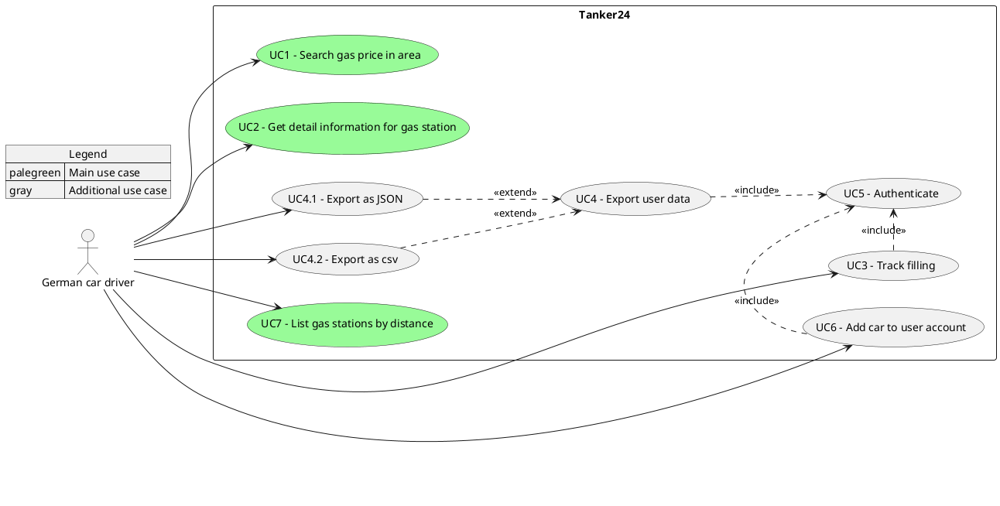

# Introduction and Goals

Our recipe service is a web application that helps users manage and use their cooking recipes.
The target user is the home cook in search for a minimalistic and clean way to organize their recipes.

## Requirements Overview

A short description of the core functional requirements for our system. For a detailed list see our [requirements document](../requirements.md).

| UseCaseID | Short Description                                                              |
| --------- | ------------------------------------------------------------------------------ |
| UC-01     | The system shall display an searchable overfiew for all recipes                |
| UC-02     | The system shall display recipes in a dedicated page with scalabel ingredients |
| UC-03     | The system shall allow registered users to export recipes as pdf               |

_TODO:_ Some sort of use case diagram

## Quality Goals

Our top three quality goals:

_TODO:_ decide on quality goals
| Priority | Quality Goal | Scenario |
| --- | --- | --- |
| 1 | TBD | TBD |
| 2 | TBD | TBD |
| 3 | TBD | TBD |

Reliability:

- All recipes and ingredients should be displayed accurately
- App should recover from API not working

Performance:

- App should start under 2sec
- Latency for all actions within the app (excluding pdf generation) should be under 1sec

## Stakeholders

| Role              | Contact Channels     | Expectations                                                                        |
| ----------------- | -------------------- | ----------------------------------------------------------------------------------- |
| Dev Team          | Lecture, Dev channel | Guided introduction to professional software quality assurance                      |
| Course Instructor | Lecture, Mail        | Adherence of project to course requirements listed in [roadmap](../requirements.md) |
