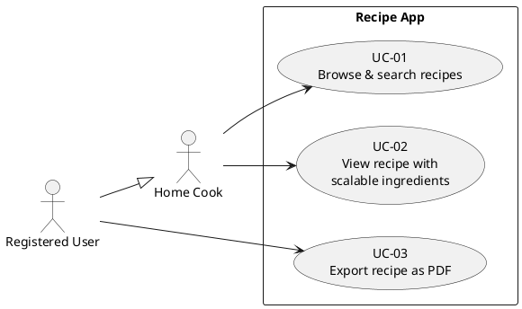

# Introduction and Goals

Our recipe service is a web application that helps users manage and use their cooking recipes.
The target user is the home cook in search for a minimalistic and clean way to organize their recipes.

## Requirements Overview

A short description of the core functional requirements for our system. For a detailed list see our [requirements document](../requirements.md).

| UseCaseID | Short Description                                                              |
| --------- | ------------------------------------------------------------------------------ |
| UC-01     | The system shall display a searchable overview of all recipes                  |
| UC-02     | The system shall display recipes on a dedicated page with scalable ingredients |
| UC-03     | The system shall allow registered users to export recipes as PDF               |

## Quality Goals

Our top three quality goals (categories based on ISO 25010):

| Priority | Quality Goal (ISO 25010) | Scenario                                                                                                                                          |
| -------- | ------------------------ | ------------------------------------------------------------------------------------------------------------------------------------------------- |
| 1        | Reliability              | Recipes and ingredients are always displayed accurately. When the external PDF API is unavailable, the app stays usable and recovers gracefully.  |
| 2        | Performance Efficiency   | The app starts in under 2 s. All in-app actions (excluding PDF generation) respond in under 1 s.                                                  |
| 3        | Security                 | Write operations require a valid JWT bearer token; unauthenticated write requests are rejected (see [ADR-002](../adr/adr002_secure_endpoint.md)). |

## Stakeholders

| Role              | Contact Channels     | Expectations                                                    |
| ----------------- | -------------------- | --------------------------------------------------------------- |
| Dev Team          | Lecture, Dev channel | Guided introduction to professional software quality assurance  |
| Course Instructor | Lecture, Mail        | Adherence of project to course requirements listed in checklist |
