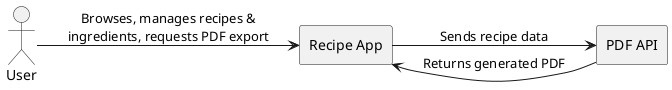
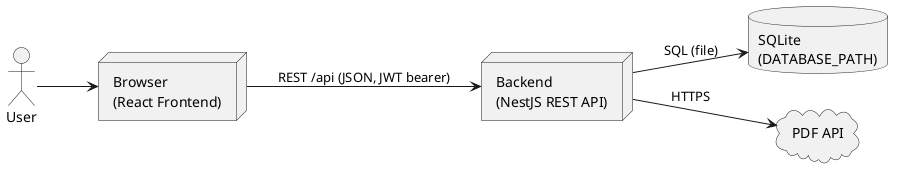

# Context and Scope

Definition of the system scope and context. This chapter delimits the Recipe App from its
communication partners — its users and the external PDF API — and describes the domain and
technical interfaces between them.

## Business Context

The Recipe App is used by a single type of user to manage and view cooking recipes. To export
a recipe as a PDF, the app delegates document generation to an external PDF API.

| Communication Partner | Input (to Recipe App)                                         | Output (from Recipe App)                  |
| --------------------- | ------------------------------------------------------------- | ----------------------------------------- |
| User                  | Recipe & ingredient data, search queries, PDF export requests | Recipe overview, recipe details, PDF file |
| PDF API               | Generated PDF document                                        | Recipe data to be rendered                |

## Technical Context

The user accesses the app through a browser. The React frontend talks to the NestJS backend
over a REST API (`/api`), which persists data in a local SQLite file and calls the external
PDF API over HTTPS.

| Channel            | Protocol / Format                                          |
| ------------------ | ---------------------------------------------------------- |
| Browser ⇄ Frontend | HTTP (Vite-served single-page app)                         |
| Frontend ⇄ Backend | REST `/api`, JSON; write operations use a JWT bearer token |
| Backend ⇄ Database | SQL against a local SQLite file (`DATABASE_PATH`)          |
| Backend ⇄ PDF API  | HTTPS                                                      |
