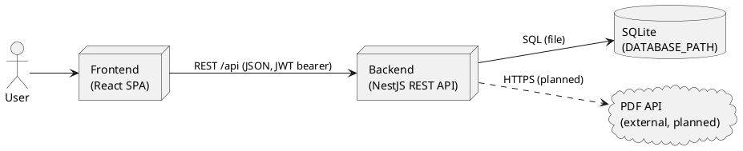
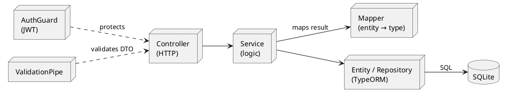
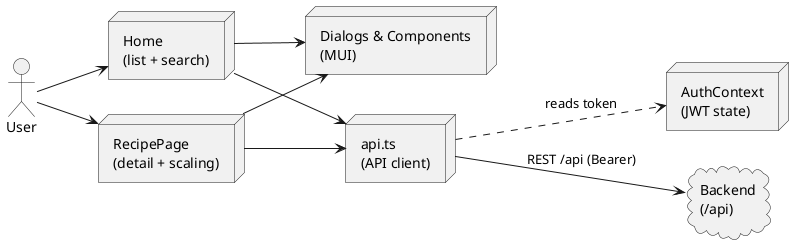

# Building Block View

The static decomposition of the Recipe App into building blocks and their dependencies.

- Level 1: shows the overall system as a white box with its top-level building blocks.
- Level 2: zooms into the backend and the frontend.

## Level 1: Whitebox Overall System

The system is split along a layered architecture
(see [ADR-001](../adr/adr001_core_architecture.md)) so that the user interface, the API logic and
the data store can be understood and changed independently.

**Contained Building Blocks:**

| Name                 | Responsibility                                                                                    |
| -------------------- | ------------------------------------------------------------------------------------------------- |
| Frontend (React SPA) | Renders the UI, lets users browse, search and manage recipes, and talks to the backend over REST. |
| Backend (NestJS API) | Exposes the `/api` REST endpoints, validates input, enforces authentication and persists data.    |
| Database (SQLite)    | Stores recipes, ingredients and users in a single local file.                                     |
| PDF API (external)   | Renders a recipe into a PDF document. _Planned — not yet integrated (see requirement #4)._        |

The `@app/shared` package holds the domain types and DTOs shared by frontend and backend; it is
the contract between them.

## Level 2: Backend

The backend has three feature modules. Each follows the same layered shape: a controller
(HTTP), a service (business logic), a mapper (entity → shared type), an entity with its
TypeORM repository (persistence) and a dto (class-validator). Two cross-cutting building
blocks apply to every route: a global `AuthGuard` (protects routes; opt out with `@Public()`) and a
global `ValidationPipe`.

| Module      | Responsibility                                                                                        |
| ----------- | ----------------------------------------------------------------------------------------------------- |
| Recipes     | CRUD for recipes under `/api/recipes`. Reads are public; writes require a JWT.                        |
| Ingredients | CRUD for a recipe's ingredients under `/api/recipes/:recipeId/ingredients`. Reads public, writes JWT. |
| Auth        | Issues JWTs via `POST /api/auth/login`, verifies bearer tokens and hashes passwords (bcrypt).         |

## Level 2: Frontend

The pages and reusable components render the UI; all backend traffic goes through the `api.ts`
client, which attaches the JWT held by `AuthContext`.

| Building Block             | Responsibility                                                                         |
| -------------------------- | -------------------------------------------------------------------------------------- |
| `api.ts` (API client)      | Wraps all `/api` calls and attaches the `Authorization: Bearer` header when logged in. |
| `AuthContext`              | Holds the JWT (in `localStorage`) and exposes login/logout state to the app.           |
| `Home` page                | Lists recipes and filters them with a client-side, debounced search.                   |
| `RecipePage`               | Shows a recipe's details and scales ingredient amounts client-side by portion count.   |
| Dialogs & components (MUI) | Reusable Material-UI forms for creating and editing recipes and ingredients.           |
