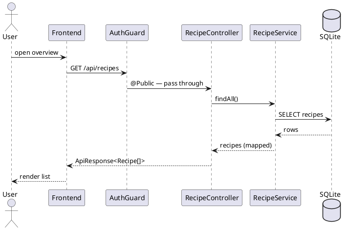
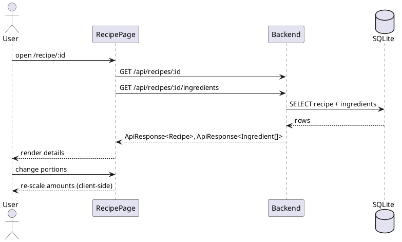
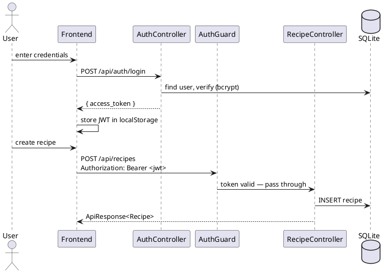
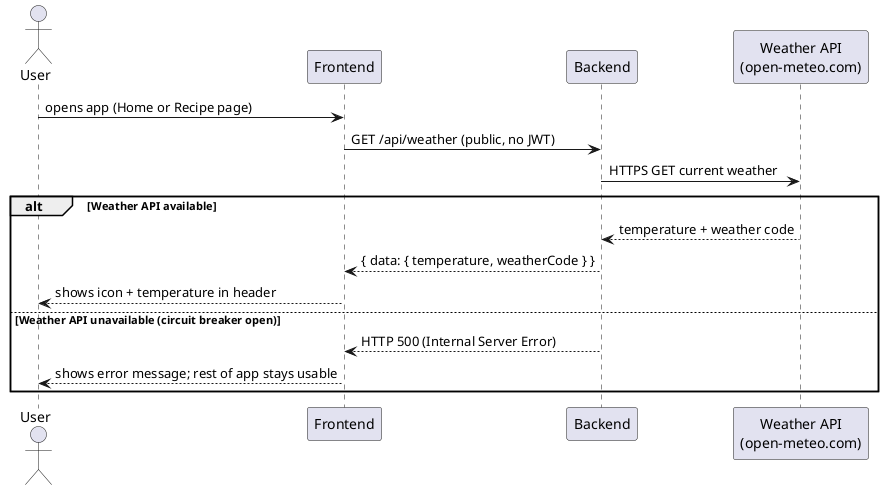

# Runtime View

How the building blocks from chapter [05](05_building_block_view.md) cooperate at runtime, shown
for the use cases of chapter [01](01_introduction_and_goals.md).

## Scenario 1: Browse & Search Recipes (UC-01)

The overview is a public `GET`, so the `AuthGuard` lets it through. Search is applied
client-side with a debounced filter over the returned list — no extra backend call.

## Scenario 2: View Recipe with Scalable Ingredients (UC-02)

The page loads the recipe and its ingredients with two parallel public `GET`s. Changing the portion
count rescales the ingredient amounts in the browser - it does not hit the backend.

## Scenario 3: Login & Authenticated Write (UC-03)

Login returns a JWT that the frontend stores and sends on every write. The global `AuthGuard`
verifies the bearer token and the `ValidationPipe` checks the request body before the controller
runs; an invalid or missing token is rejected with `401`.

## Scenario 4: Display Current Weather

The weather request is public (no JWT required). The backend calls the external Weather API via
`WeatherRepository`, which wraps the HTTP call in an opossum circuit breaker. When the circuit
breaker is open the call fails gracefully and the frontend shows an error message without
affecting other functionality (Reliability goal, chapter [01](01_introduction_and_goals.md)).
