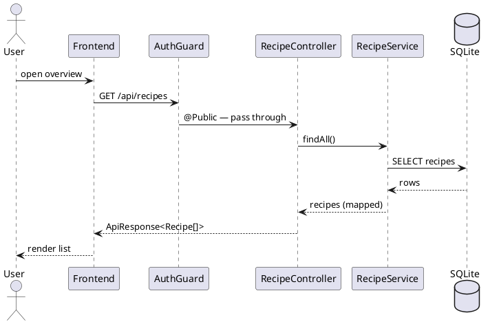
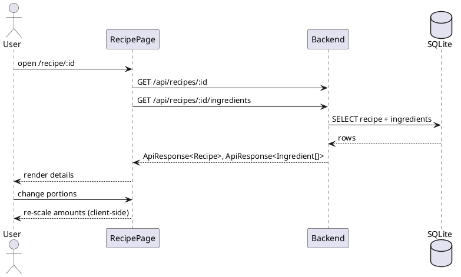
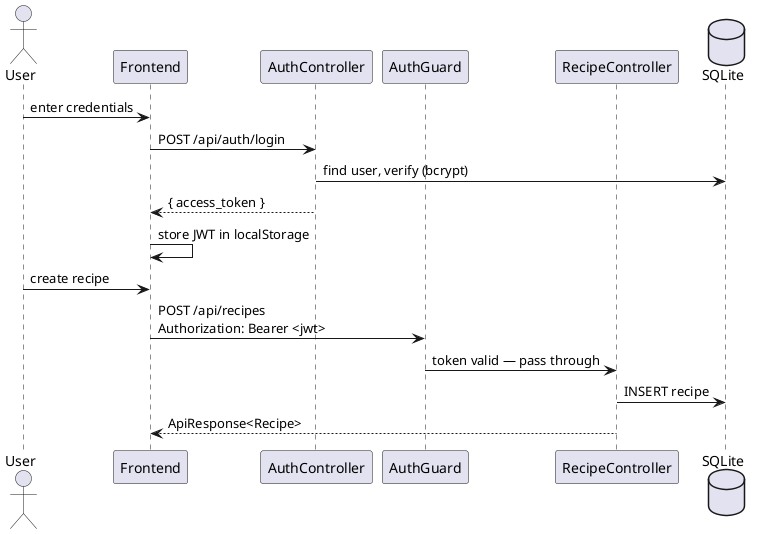
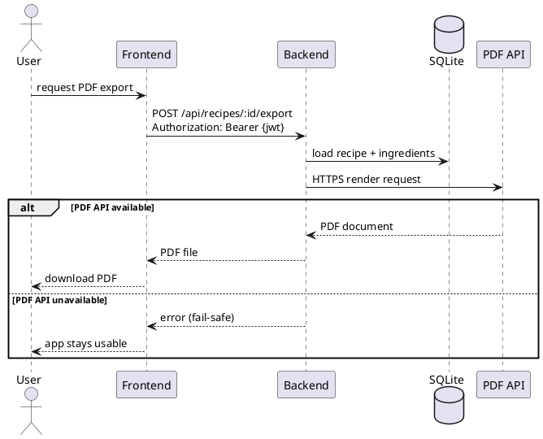

# Runtime View

How the building blocks from chapter [05](05_building_block_view.md) cooperate at runtime, shown
for the use cases of chapter [01](01_introduction_and_goals.md).

## Scenario 1: Browse & Search Recipes (UC-01)

The overview is a public `GET`, so the `AuthGuard` lets it through. Search is applied
client-side with a debounced filter over the returned list — no extra backend call.

## Scenario 2: View Recipe with Scalable Ingredients (UC-02)

The page loads the recipe and its ingredients with two parallel public `GET`s. Changing the portion
count rescales the ingredient amounts in the browser - it does not hit the backend.

## Scenario 3: Login & Authenticated Write (UC-03)

Login returns a JWT that the frontend stores and sends on every write. The global `AuthGuard`
verifies the bearer token and the `ValidationPipe` checks the request body before the controller
runs; an invalid or missing token is rejected with `401`.

## Scenario 4: Export Recipe as PDF (UC-03 — Planned)

!!! note "Planned"
This flow is not yet implemented (see requirement #4). It documents the intended behaviour.

The export is an authenticated request. The backend gathers the recipe and its ingredients and
delegates rendering to the external PDF API over HTTPS. A timeout / fallback isolates that call so
the rest of the app keeps working when the PDF API is unavailable (Reliability goal, chapter
[01](01_introduction_and_goals.md)).
