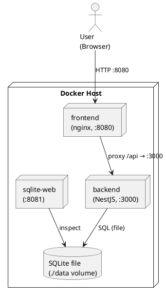

# Deployment View

The Recipe App runs as a single, self-contained Docker Compose stack on one host. There is no
remote or cloud production environment; the same stack is used for local runs and demos, which
satisfies the ≤ 2-command setup constraint (`docker compose up --build`, see chapter
[02](02_architecture_constraints.md)).

## Infrastructure Level 1

Packaging every part as a container keeps setup to a single command and runs the
same way on Linux, macOS and Windows. The browser only talks to the frontend container; nginx
serves the built SPA and proxies `/api/` to the backend, so the backend port need not be exposed
to the public.

**Mapping of Building Blocks to Infrastructure:**

| Container / Element | Image / Build                  | Port (host→container) | Contains                                                          |
| ------------------- | ------------------------------ | --------------------- | ----------------------------------------------------------------- |
| `frontend`          | `frontend/Dockerfile` (nginx)  | 8080 → 80             | Built React SPA; proxies `/api/` to `backend:3000`.               |
| `backend`           | `backend/Dockerfile` (Node 24) | 3000 → 3000           | NestJS REST API; reads/writes the SQLite file.                    |
| `sqlite-web`        | `coleifer/sqlite-web`          | 8081 → 8080           | Web UI to inspect the database (development convenience).         |
| `./data` volume     | host bind mount                | —                     | Persists `database.sqlite`; shared by `backend` and `sqlite-web`. |

**Notes:**

- Both `backend` and `frontend` are multi-stage builds: a Node 24 builder compiles `shared` then
  the workspace, and the runtime image ships only the build artifacts (nginx for the frontend,
  `node backend/dist/main.js` for the backend).
- The backend reads `DATABASE_PATH=/app/data/database.sqlite` and `JWT_SECRET` from the environment;
  in production `JWT_SECRET` must be set (see [ADR-002](../adr/adr002_secure_endpoint.md)).
- All services use `restart: unless-stopped`. The `./data` directory is gitignored and created on
  first run.
- Under Linux: Depending on the hosts settings the `./data` directory is owned by `root`. In this case the ownership of the directory must first be change to the user, before a new user can be added. Alternatively use `podman` instead.

For day-to-day development the stack is run without Docker via `npm run dev` (frontend on `:5173`
proxying `/api` to the backend on `:3000`); the building blocks are identical, only the hosting and
ports differ.
