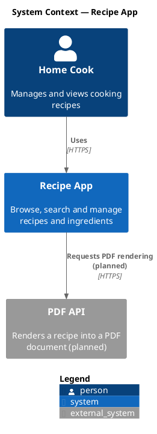
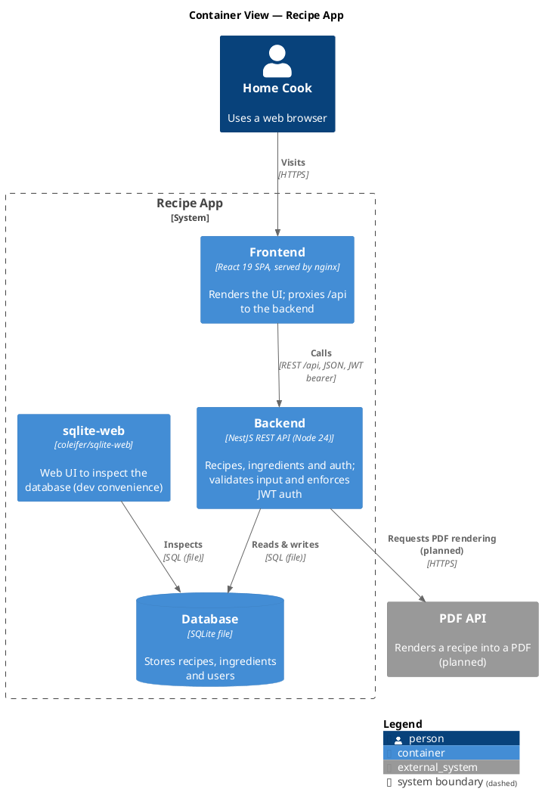
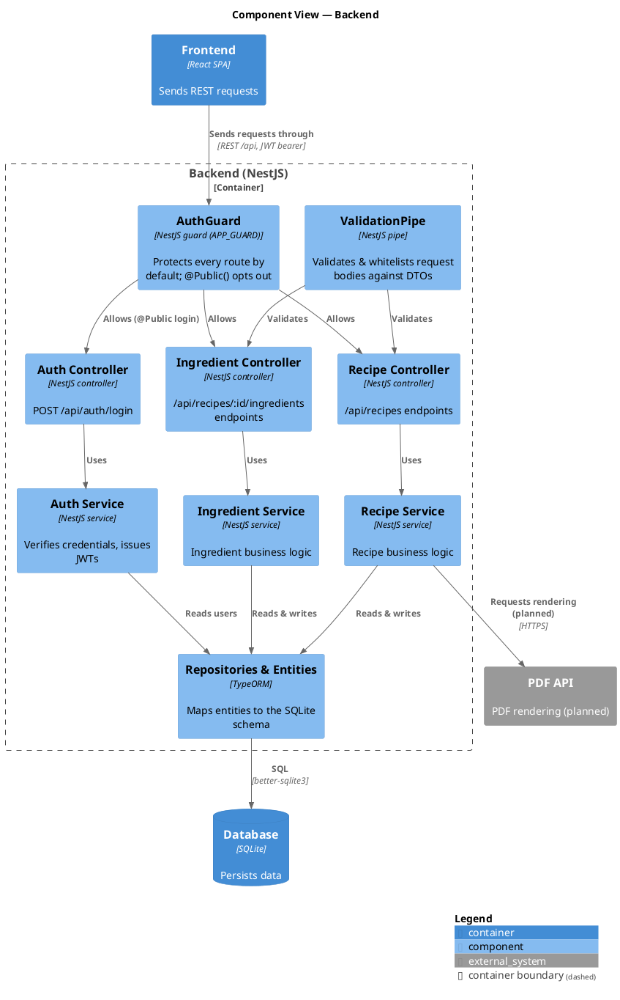
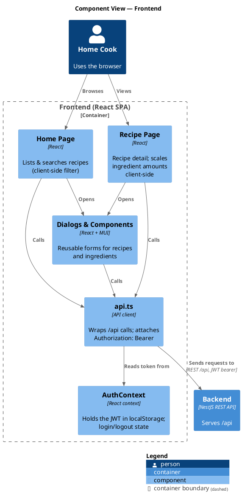

# C4 Model

A C4 model of the Recipe App for the project presentation, from system context down to the
components of the backend and frontend. The external PDF API is shown as **planned** — it is
documented but not yet implemented.

## Level 1: System Context

## Level 2: Container

## Level 3: Components — Backend

## Level 3: Components — Frontend

